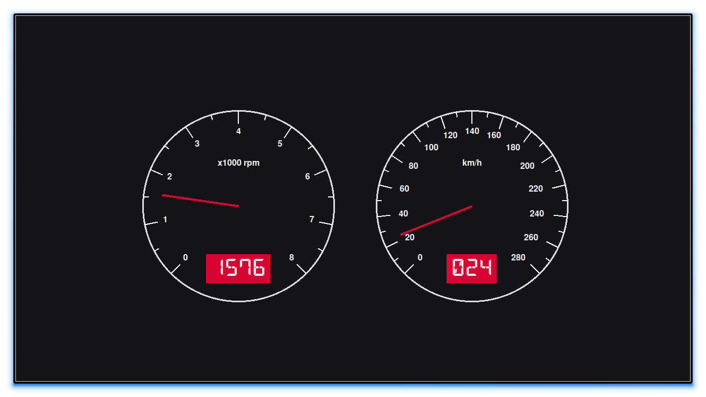

<div align = "center">

<h1><a href="https://2kabhishek.github.io/CarBoard">CarBoard</a></h1>

<a href="https://github.com/2KAbhishek/CarBoard/blob/main/LICENSE">
 </a>

<a href="https://github.com/2KAbhishek/CarBoard/pulse">
 </a>

<a href="https://github.com/2KAbhishek/CarBoard/stargazers">
</a>

<a href="https://github.com/2KAbhishek/CarBoard/network/members">
 </a>

<a href="https://github.com/2KAbhishek/CarBoard/watchers">
 </a>

<a href="https://github.com/2KAbhishek/CarBoard/graphs/contributors">
 </a>

<a href="https://github.com/2KAbhishek?tab=followers">
 </a>

<h3>Dashboard for Car Diagnostics 🚘🧮</h3>

<figure>
  
  <br/>
  <figcaption>CarBoard screenshot</figcaption>
</figure>

</div>

## What is this

CarBoard is a dashboard app that displays diagnostic information about your car.

## Inspiration

Came across an [ELM327](https://en.wikipedia.org/wiki/ELM327) device, wanted to learn more.

## Prerequisites

Before you begin, ensure you have met the following requirements:

- You have installed the latest version of `python`

## Getting CarBoard

To install CarBoard, follow these steps:

```bash
git clone https://github.com/2kabhishek/CarBoard
cd CarBoard
```

## Using CarBoard

```bash
# Install the dependencies:
pip install -r requirements.txt
# Run the elm emulator:
python3 -m elm -n 35000 -s car
# Run the dashboard:
python3 -m carboard.py
```

## How it was built

- CarBoard was built using `python3` and `tkinter`.

- [ELM327-emulator](https://github.com/Ircama/ELM327-emulator) to communicate with a virtual car's ECU.

- [DSEG](https://github.com/keshikan/DSEG) a very pretty retro font for displaying the car's diagnostic data.

## Challenges faced

- Searching for resources around [ECU](https://en.wikipedia.org/wiki/Engine_control_unit) and [OBD-II](https://en.wikipedia.org/wiki/On-board_diagnostics) was a challenge.

## What I learned

- Learned a lot about ECU and OBD-II and a few things about a car's internals.

## What's next

ELM327 has more types of diagnostic data, those could be implemented in CarBoard.

Hit the ⭐ button if you found this useful.

## More Info

<div align="center">

<a href="https://github.com/2KAbhishek/CarBoard">Source</a> |
<a href="https://2kabhishek.github.io/CarBoard">Website</a>

</div>
